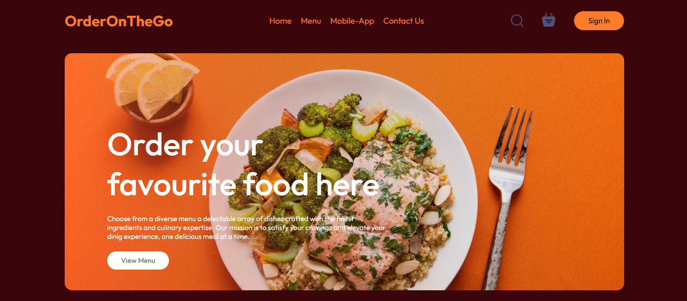
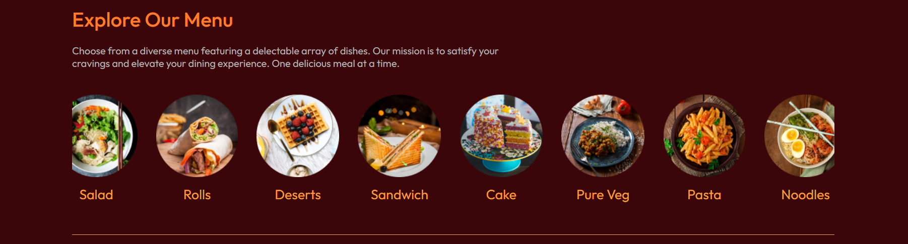
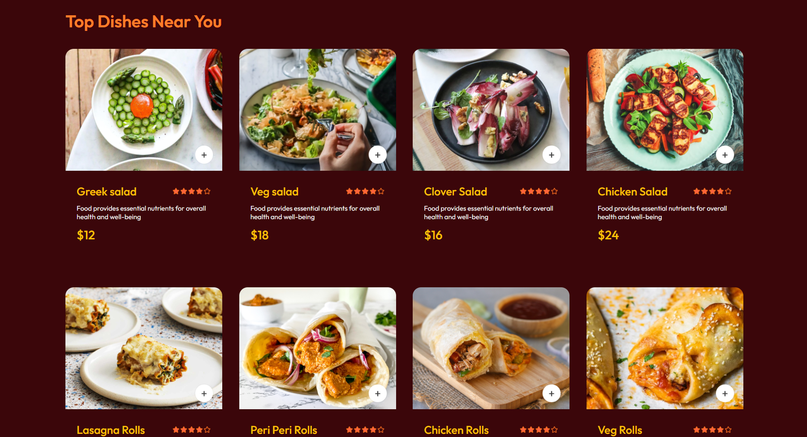

# 🚀 Project Link

🔗 **Live Demo:** [Click Here](https://your-project-link.com)  
🔗 **GitHub Repo:** [View Code](https://github.com/your-username/your-repo)


# 🍜 OrderOnTheGo : A responsive frontend food ordering web application that allows users to browse menus and explore food items through a clean and interactive user interface.


## 📷 Screenshots  

  

  

  


## ✨ Features  

- User-friendly interface  
- Responsive design  
- Fast performance  
- Authentication (if any)  
- API integration (if any)  


## 🛠️ Tech Stack  

**Frontend:**  
HTML | CSS | JavaScript | React  

**Backend:**  
Node.js | Express.js  

**Database:**  
MongoDB / MySQL  


## ⚙️ Installation  

```bash
git clone https://github.com/by-aisha/Food-Web.git
cd Food-Web
npm install
npm start
